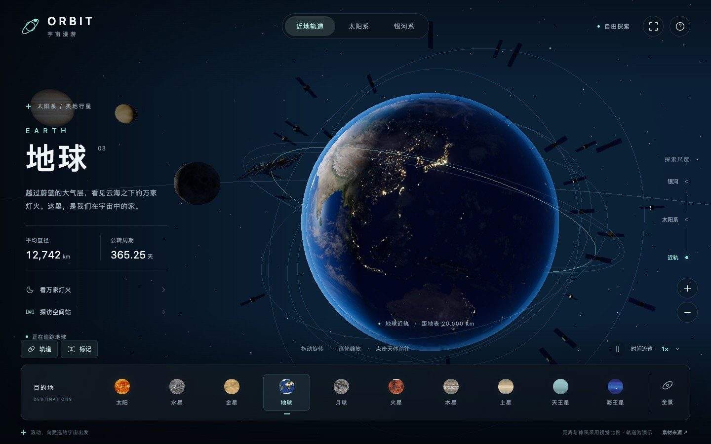

# ORBIT · 漫游宇宙 · 感知地球

[简体中文](README.md) | [English](README_EN.md)

**Explore the Universe. Sense the Earth.**

当前版本：**1.5.0**。

**线上体验：** [https://ryh842487118-bot.github.io/orbit/](https://ryh842487118-bot.github.io/orbit/)

直接双击本目录的 **index.html** 即可使用。Three.js 和 15 张纹理（含地球 8K 日夜源图）已嵌入 HTML，宇宙漫游无需联网、安装依赖或启动服务器。EarthSense 通过公开接口按需联网。建议使用支持 WebGL 2、已开启硬件加速的新版 Chrome、Edge 或 Safari。

## 演示视频

[](demo.mp4)

**[查看演示视频](demo.mp4)** · [下载 MP4](https://github.com/ryh842487118-bot/orbit/raw/refs/heads/main/demo.mp4)

58 秒，1440 × 900，30 FPS。实际网页录制，依次展示地球夜景、国际空间站、月球、木星、土星环、太阳系轨道与银河，最后返回地球。

## 探索

- 鼠标拖动旋转视角；滚轮缩放；触屏单指旋转、双指捏合缩放。
- 从地球持续缩小，可依次进入太阳系、银河和本星系群尺度；持续放大则回到所追踪天体。
- 点击底部天体、场景中的天体或标记，可以平滑飞向目的地。
- 本星系群开放 **银河系、仙女座星系、三角座星系、大麦哲伦星云、小麦哲伦星云** 五座星系。选择一座星系后，底部展开其中的恒星和巨行星；通过「所属星系」「恒星系全景」「星系群」返回上层视野。
- 新增 **8 个真实恒星目标**：参宿四、HR 8799、AF And、AE And、罗马诺之星、R136a1、WOH G64、HD 5980。其中 HD 5980 是以单个发光天体呈现的多星系统。
- 新增 **4 颗已确认的 HR 8799 巨行星 b、c、d、e**，以及 **4 颗明确标注「虚构／示意」的河外巨行星**，让每座新星系都有可抵达的行星场景。虚构行星与附近真实恒星的配对仅供展示，不代表已发现的行星或真实轨道；所有系外行星表面均为艺术化表现。查看 [深空目录与资料来源](docs/deep-space-sources.md)。
- 地球左侧提供「看万家灯火」「探访空间站」。
- 顶部提供「近地轨道」「太阳系」「银河系」「星系群」快捷导航。
- 轨道、标记可以独立开关；天体运动支持暂停及 0.25×、1×、5×、20× 演示流速。
- 星空中偶尔会有暖色陨石或双拖尾彗星划过，每次一颗、随机间隔；随暂停停止，在感知地球和减少动态效果模式下隐藏。
- 快捷键：`+` / `-` 缩放，空格暂停，`H` 回地球，`F` 全屏，`I` 隐藏界面，`?` 操作说明。

## 感知地球 EarthSense

点击顶部「感知地球」进入模式。天气与台风效果叠加在原来的 Three.js 地球上，只有地球近景才渲染；仍可拖动、滚轮或捏合放大查看。进入模式时暂驻天体运动；切回「宇宙漫游」会恢复进入前的镜头、目标、未完成的飞行、流速和开关。

- 当前开放 **天气、闪电、台风** 三个图层，默认全部开启，可独立开关。
- 点击天气／闪电云团或台风云带查看来源、时间、坐标和指标；也可通过事件列表搜索并飞到对应位置，再用「放大查看」靠近地表。晴天没有云团时，从列表查看对应采样点。列表优先展示台风和闪电，其后为天气。
- 切到其他天体或缩小至太阳系、银河时自动收起地球图层，返回地球继续查看。
- 天气使用 Open-Meteo 的 60 个规则采样点，展示气温、风速风向、降水、降雨和云量，不是连续气象场。晴／大致晴朗代码 `0 / 1` 不生成云雨；感知模式关闭原有固定装饰云层。累计降水按来源时间间隔换算为 mm/h，连续控制雨线密度、速度、长度和范围。
- 天气图层只有雷暴代码 `95 / 96 / 99` 才显示闪电；随雨率增强，示意闪电的循环间隔由约 18 秒缩短至 4 秒。这是表现强弱的动画节奏，来源没有提供逐次落雷或实测闪电频率。
- 局部天气云沿球面铺展，半透明云丝缓慢流动，明暗随太阳方向变化；雷暴闪现短暂照亮云内。云形与运动是对采样天气的视觉表达。
- 台风在真实事件中心呈现薄云、低眼墙、开放风眼与不等宽螺旋云带；云带细节以不同节奏流动，局部演示电光短暂亮起。来源风速连续控制视觉半径与旋转速度，GDACS 列表最大值与选中后的当前观测值分别标明。云形和半径不是实况云图或官方风圈，电光不表示观测到的落雷或频率。
- 点击台风后按需读取该次 GDACS 公告的真实历史与预测路径：历史为实线、预测为虚线，时间点可点击查看坐标、风速及有效时间。详情保留来源和公告时间；没有预测或无法确认当前公告时明确说明，不外推路径。关闭详情、关闭台风图层、离开地球或切换模式会取消路径请求并清除所选路径。
- 台风数据来自 GDACS 热带气旋预警和 NASA EONET 的未关闭风暴事件；EONET 最多读取 100 项，匹配的重复事件优先采用 GDACS。EONET 提供历史位置记录，不提供官方预测路径，详情会明确标注。
- 独立「闪电」图层保留 **6 个模拟雷暴点**，默认开启，卡片明确标注模拟数据。
- 各源显示独立加载、空结果、错误、部分可用和缓存状态。刷新失败保留可用旧数据并标示；退出模式取消进行中的请求、停止刷新。

数据源可能延迟，事件时间以详情中的来源记录为准。查看 [数据来源与接口说明](docs/data-sources.md) 和 [重构验证记录](docs/refactor-validation.md)。

宇宙漫游与感知模式共用同一套高清地球、细分几何、原有昼夜着色与泛光参数，切换模式不会降低贴图清晰度或改变地球亮度。应用启动后异步准备高清贴图：桌面优先使用 **8192 × 4096**，手机布局或设备报告内存不高于 4 GB 时使用 **4096 × 2048**，并受 GPU 最大纹理尺寸限制；能力不足或加载失败时保留原 2K 贴图。4K 版本在运行时从原始 8K 图生成，不修改源文件。原有装饰云层只在宇宙漫游中显示，感知模式显示采样天气驱动的局部云雨。

## 实现范围

Three.js r185；地球昼夜着色、夜景灯光、独立云层、大气边缘；32 颗卫星、简化国际空间站、月球；太阳、八大行星、土星透明环；太阳系轨道；程序生成的三座螺旋星系与两座不规则矮星系；独立恒星系、程序化巨星与巨行星表面、宿主恒星方向光照；分距离显示天体和轨道；对数深度缓冲；泛光后处理；响应式界面。

这是交互可视化，天体尺寸、距离、轨道位置与速度经过视觉调整，不是实时天文星历。卫星和空间站模型尺寸有意放大；五座星系均为示意模型，五座是开放探索的数量而非本星系群的全部成员。HUD 近景距离根据视觉单位换算，适用于演示。

## 调试接口

页面加载完成后，可在浏览器控制台使用 `ORBIT.destinations()` 查看五座星系和 16 个新增天体的目录，返回 ID、名称、类型、所属星系、宿主恒星及模型状态。原有太阳系天体仍使用原来的导航 ID。

```js
console.table(ORBIT.destinations());
ORBIT.goTo('local-group'); // 本星系群总览
ORBIT.goTo('andromeda');   // 飞向仙女座星系
ORBIT.goTo('hr8799-b');    // 飞向已确认的巨行星
ORBIT.getState();          // 包含 activeGalaxyId、activeSystemId 和当前探索尺度
```

新增目录中的 `modelStatus: 'confirmed'` 表示天体真实存在，`'illustration'` 表示虚构示意；已确认天体的艺术纹理、场景比例和轨道动画也经过视觉调整。

## 文件

- `src/shell.html`：页面和交互控件。
- `src/style.css`：界面样式与手机布局。
- `src/universe.js`：仅保留兼容入口；`src/app.js` 组装场景和逐帧调度。
- `src/core/`：渲染管线、相机飞行、场景组装和纹理加载。
- `src/universe/`：天体目录、行星、太阳系运动、轨道、卫星、星系群和独立深空恒星系。
- `src/earth/`：地球昼夜光照、大气、云层、经纬度坐标及按需高清纹理。
- `src/earthsense/`：当前天气、闪电、台风图层、数据状态和模式保存恢复；`effects/` 提供天气云雨、雷暴与台风示意效果。
- `src/data/`：Open-Meteo、NASA EONET、GDACS 的独立适配器、风速单位转换与请求缓存；`cyclone-track.js` 按需读取官方台风路径。
- `src/ui/`：原有导航、标签、EarthSense 面板、事件详情和附加样式。
- `tests/`：导航、深空目录与天体跟随、地理坐标、图层拾取、模式恢复、缓存、取消与数据适配测试。
- `docs/`：重构验证记录、公开数据说明及深空天体资料来源。
- `assets/`：原始纹理、来源和许可。
- `build.mjs`：将引擎、场景脚本和纹理打包进一个 HTML。
- `index.html`：单文件构建产物。
- `demo.mp4`：网页演示视频。
- `demo-preview.jpg`：README 视频预览图。

安装依赖：`npm install`；运行测试：`npm test`；重新构建：`npm run build`。输出写入本目录的 `index.html`，所有依赖均来自本项目。

太阳系纹理来自 [Solar System Scope](https://www.solarsystemscope.com/textures/)，采用 [CC BY 4.0](https://creativecommons.org/licenses/by/4.0/)；使用时通过实时光照和着色显示。新增深空天体使用程序化艺术表面。完整清单见 `assets/CREDITS.md`。Three.js 使用 MIT 许可证，见 `assets/THREE-LICENSE.txt`。
